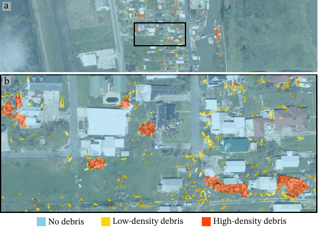

<div align="center">

# Debris Segmentation using Post-Hurricane Aerial Imagery

<a href="https://pytorch.org/get-started/locally/"></a>
<a href="https://pytorchlightning.ai/"></a>
<a href="https://hydra.cc/"></a>
<a href="https://github.com/ashleve/lightning-hydra-template"></a>  
[](https://colab.research.google.com/drive/1oMWaTxJeKPPEC9kHV3hbSnCY2CSD9qTg?usp=sharing)
[](<./notebooks/DEMO%201%20-%20Debris%20Prediction.ipynb>)
[](https://www.designsafe-ci.org/data/browser/public/designsafe.storage.published/PRJ-6029)
[-4b44ce.svg)](https://onlinelibrary.wiley.com/doi/10.1111/mice.70033)
[](#citation)
[](https://arxiv.org/abs/2504.12542)
</div>

## Description

This is the official implementation of the paper *Debris Segmentation using Post-Hurricane Aerial Imagery*.
To quickly experiment with the proposed debris segmentation model (called *CLIPSeg-debris*), we recommend trying this [Colab demo](https://colab.research.google.com/drive/1oMWaTxJeKPPEC9kHV3hbSnCY2CSD9qTg?usp=sharing).

<div align="center">
  
</div>

## Dataset

Our debris segmentation dataset comprises **1,200+ manually annotated aerial RGB images** from three major hurricane events:

- **Hurricane Ian (2022)**: 685 images from Estero Island and Fort Myers, FL
- **Hurricane Ida (2021)**: 273 images from Grand Isle, Port Fourchon, and Golden Meadow, LA
- **Hurricane Ike (2008)**: 284 images from Galveston Island, TX

**Key Features:**
- Multiple annotators with consensus labeling to reduce human bias
- Balanced dataset with debris-positive and debris-free samples
- Diverse environmental conditions and sensor resolutions (5-50cm)
- Three debris classes: no debris, low-density debris, high-density debris

## Performance

CLIPSeg-debris achieves state-of-the-art performance when evaluated on Hurricane Ida imagery (entirely excluded from training):

### Detailed Results

| Method | Dice ↑ | IoU ↑ | **Recall ↑** | | | **Precision ↑** | | |
|--------|--------|-------|-------------|---|---|--------------|---|---|
| | All | All | Debris-free | Low-density | High-density | Debris-free | Low-density | High-density |
| UNet | 0.79 | 0.76 | 0.98 | **0.84** | 0.90 | **0.99** | 0.51 | **0.94** |
| DeepLabV3 | 0.82 | 0.79 | **0.99** | 0.67 | 0.92 | **0.99** | 0.79 | 0.86 |
| CLIPSeg | 0.54 | 0.52 | 0.83 | 0.54 | **0.96** | **0.99** | 0.79 | 0.33 |
| **CLIPSeg-debris** | **0.86** | **0.83** | **0.99** | 0.69 | 0.92 | **0.99** | **0.80** | **0.94** |

**Key Achievements:**
- **Best overall performance**: 0.86 Dice score and 0.83 IoU
- **Superior precision**: Lowest false positive rates across all debris classes
- **Robust generalization**: Tested on entirely unseen hurricane event and geographic region

## Installation

#### Pip

```bash
# clone project
git clone https://github.com/Way-Yuhao/CLIPSeg-debris
cd CLIPSeg-debris

# [OPTIONAL] create conda environment
conda create -n clipseg python=3.10
conda activate clipseg
```

Install PyTorch according to instructions: https://pytorch.org/get-started/.  
Install the remaining dependencies using pip:
```bash
# install requirements
pip install -r requirements.txt
```

## How to run

- Navigate to Design-Safe to download the [annotated debris dataset](https://doi.org/10.17603/ds2-jvps-2n95) proposed in this work.
- Download [model weights](https://huggingface.co/YuhaoL/CLIPSeg-debris) from Hugging Face.

### Train & Fine-tune
Fine-tune the CLIPSeg model on the dataset using the provided training script.

```bash
# training on GPU 0, for example: 
python ./src/train.py experiment=clipseg_finetune trainer.devices=[0]
```
Experiment configuration can be found from [configs/experiment/](configs/experiment/)

### Test & Evaluate
Test the fine-tuned model on the dataset using the provided testing script.

```bash
python ./src/eval.py experiment=retest trainer.devices=[0] name=DIR_NAME ckpt_path=CKPT_PATH
```
Replace `DIR_NAME` with the name of the directory where the results will be saved, and `CKPT_PATH` with the path to the 
checkpoint file of the fine-tuned model.

### Prediction
Predict the segmentation mask for a single image using the fine-tuned model.

```bash
python ./src/eval.py trainer.devices=[0] data.query_images_dir=INPUT_DIR ckpt_path=CKPT_PATH name=DIR_NAME
```
Replace `INPUT_DIR` with the directory containing the input images, `CKPT_PATH` with the path to the checkpoint file 
of the fine-tuned model, and `DIR_NAME` with the name of the directory where the results will be saved.

___

### Citation
If you find this code useful in your research, please consider citing:
```latex
@article{amini2025debris,
  title={Debris segmentation using post-hurricane aerial imagery},
  author={Amini, Kooshan and Liu, Yuhao and Padgett, Jamie Ellen and Balakrishnan, Guha and Veeraraghavan, Ashok},
  journal={Computer-Aided Civil and Infrastructure Engineering},
  year={2025},
  publisher={Wiley Online Library}
}
```
